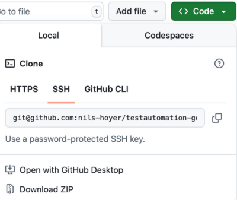

# Playwright Test Automation - Getting Started

Dieses Repository ist die Basis für die Kurse auf https://www.codesurfer.io/kurse.
Folge dieser Anletitung, um deine Playwright Testumgebung einzurichten:

### Voraussetzungen

1. **Visual Studio Code installieren**
   - Download: https://code.visualstudio.com/download
   - Installiere VS Code auf deinem System

2. **Playwright Extension installieren**
- Öffne VS Code
    - Gehe zu Extensions
    - Suche nach "Playwright Test for VS Code" und installiere die Extension
    
    

3. **Node.js installieren**
   - Benötigt: Node.js Version 20 oder neuer
   - Download: https://nodejs.org/en/download

### Repository Setup

4. **Repository herunterladen**
   - Klicke auf den grünen "Code" Button und dann "Download ZIP"
   - Oder nutze Git: `git clone <repository-url>`
   
    

5. **Projekt in VS Code öffnen**
- Öffne VS Code
    - Datei > Ordner öffnen... und wähle den heruntergeladenen Ordner
    - Die NPM-Skripte findest du links im Explorer unter "NPM SkRIPTS"
    
    
    
### Installation und Setup

**Wichtig**: Die Ausgaben der folgenden Befehle siehst du im Terminal-Tab im unteren Bereich von VS Code.

6. **Abhängigkeiten installieren**
   ```bash
   npm install
   ```
   - Installiert Playwright und alle benötigten Pakete

7. **Browser installieren**
   ```bash
   npx playwright install
   ```
   - Lädt die Test-Browser herunter (Chromium, Firefox, WebKit)

8. **Setup überprüfen**
   ```bash
   npm run test
   ```
   - Führt die Beispiel-Tests aus


Wenn die Tests erfolgreich durchgelaufen sind, bist du bereit für den Kurs!

Happy Testing! 🎭 🚀