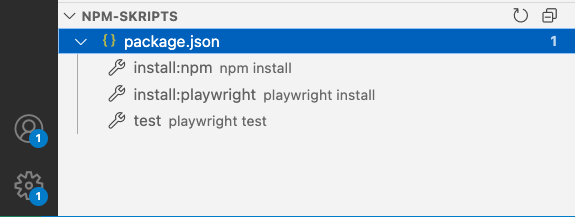

# Playwright Test Automation - Getting Started

Dieses Repository ist die Basis für die Kurse auf https://www.codesurfer.io/kurse.
Folge dieser Anleitung, um deine Playwright Testumgebung einzurichten:

### Voraussetzungen

1. **Visual Studio Code installieren**
   - Download: https://code.visualstudio.com/download
   - Installiere VS Code auf deinem System

2. **Playwright Extension installieren**
- Öffne VS Code
    - Gehe zu Extensions
    - Suche nach "Playwright Test for VS Code" und installiere die Extension
    
    

3. **Node.js installieren**
   - Benötigt: Node.js Version 20 oder neuer
   - Download: https://nodejs.org/en/download
   - Oder nutze NVM: `nvm install 22`

### Projekt Setup

4. **Dateien herunterladen**
   - Klicke auf den grünen "Code" Button und dann "Download ZIP"
   - Oder nutze Git: `git clone https://github.com/nils-hoyer/testautomation-getting-started.git`
   
    

5. **Projekt in VS Code öffnen**
- Öffne VS Code
    - Datei > Ordner öffnen... und wähle den heruntergeladenen Ordner
    
### Playwright einrichten

**Wichtig**: Die Ausgaben der folgenden Befehle siehst du im Terminal-Tab im unteren Bereich von VS Code.

**Tipp**: Die folgenden Befehle findest du auch links im Explorer unter "NPM SCRIPTS" - dann kannst du sie per Klick ausführen.

6. **Pakete installieren**
   - Starte Skript "install:npm"
   - Oder nutze Bash `npm install`
   - Installiert Playwright und alle benötigten Pakete

7. **Browser herunterladen**
   - Starte Skript "install:playwright"
   - Oder nutze Bash `npx playwright install`
   - Lädt die Test-Browser herunter (Chromium, Firefox, WebKit)
8. **Setup testen**
   - Starte Skript "test"
   - Oder nutze Bash `npx playwright test`
    - Führt die Beispiel-Tests aus und verifiziert dein Setup

Wenn die Tests erfolgreich durchgelaufen sind, bist du bereit für den Kurs!

Happy Testing! 🎭 🚀